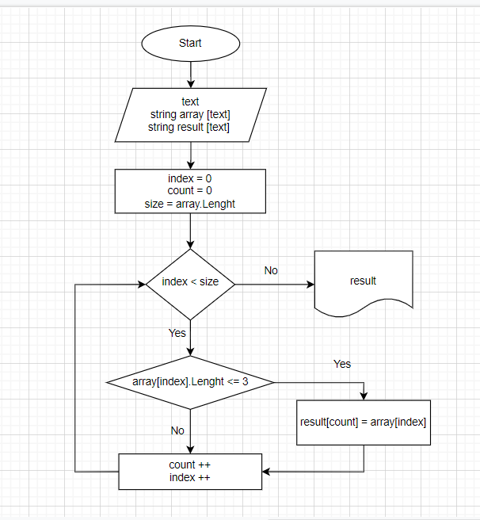

## Итоговая проверочная работа по результатам прохождения первого блока обучения по программе разработчик.

1. Создать репозиторий на GitHub
2. Нарисовать блок-схему алгоритма
3. Снабдить репозиторий оформленным текстовым описанием решения (файл README.md)
4. Написать программу, решающую поставленную задачу.
Использовать контроль версий в работе над этим небольшим проектом.

## **Задача**
**Написать программу, которая из имеющегося массива строк формирует массив из строк, длина которых меньше либо равна 3 символа. Первоначальным массив можно ввести с клавиатуры, либо задать на старте выполнения алгоритма.**

Для решения поставленной задачи я выполнила следующие шаги:
1. Для формирования первоначального массива я предусмотрела возможность пользователю вводить необходимое количество строк через пробел. Таким образом на первом этапе нет ограничения по длине массива.
2. Создала итоговый массив строк, в который должны войти только отвечающие заданным параметрам (количество символов меньше либо равно 3) строки. Длину этого массива определяем соразмерной длине массива первоначального.
3. Создала функцию, которая с помощью цикла проверяет каждый элемент первоначального массива на соответсвие его условиям, необходимым для включения в итоговый массив. При этом, для определения индекса элемента в итоговом массиве вводим новую переменную count.

Блок-схему написанной программы я разместила непосредственно в папке проекта TestWork1.

